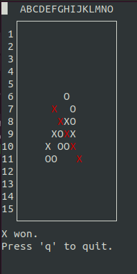

# C++ Capstone
Capstone Project for Udacity's CPP ND

# Five-in-a-raw
This project implements a console based environment in which the game Five-in-a-row can be played. Also two (somewhat primitive) AI players is provided.



## Game Description
The game is played by two players on a 15x15 checked grid. Alternatly they put a mark (1st player: X, 2nd player: O) into one cell. The first player who collects five marks next to each others (vertically, horizontally or diagonally) wins.

## How to use program
* Go to the folder containing the executable (see building instruction later)
* Start the executable
* Select the 1nd player (human or AI)
* Seéect the 2nd player (human or AI)
* Use arraw keys and space to put a mark into the grid (provided it is human's turn)
* You can quit anytime with key 'q' during the game

# Building Instructions

## Dependencies
You need development verison of library `ncurses` installed. In Linux environment you install the library this way: 

```
sudo apt install libncurses5-dev libncursesw5-dev
```

## Building
Go to the project library and follow these steps:

```
mkdir build
cd build
cmake ..
make
```

# File and Class structure

The project contains the following files and classes
* main.cpp - containing just the `main()` function
 * No classes in it
* screen.h and screen.cpp
 * Class `Screen` - Responsible for handling the screen and screen logic
* game.h and game.cpp
 * Class `Game` - Responsible for a game (match). If contains all the information from the beginning of the match, and it responsible for determining if the match is over.
* ai.h and ai.cpp
 * Class `AI` - Abstract ancestor class for all AI player
 * Class `AIRandomAll` - AI player class (rather dumb, playing randomly)
 * Class `AIRandomClose` - AI player class (a tiny bit less dumb, but still dumb, player randomly, but not to far from existing marks)
*   
# Addressed Rubric Points

